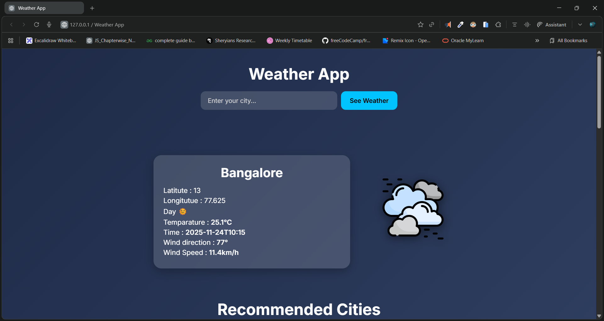

# 🌦️ Weather App

A beautifully designed, fast, and responsive Weather Application that allows users to search weather for any city in the world and also explore weather of many **recommended popular cities**.

---

## 📸 Preview



---

## 🎥 Demo Video

▶️ **Demo Video:** [click to watch](https://youtu.be/KnG4hFWqmm8)

---

## 🔗 Live Project

🌍 **Live Link:** []()

---

## ✨ Features

✔️ Search weather for any city in the world
✔️ Shows temperature, time, wind speed, wind direction & day/night status
✔️ Beautiful UI with smooth glass-morphism
✔️ Auto-generated weather icons based on weather code
✔️ Recommended popular cities (click to instantly view weather)
✔️ Fully responsive design
✔️ Uses **Open-Meteo Weather API** and **Open-Meteo Geocoding API**

---

## 🛠️ Technologies Used

* **HTML5**
* **CSS3 (Glass UI + Responsive Layout)**
* **JavaScript (Async API + Dynamic DOM)**
* **Open-Meteo API**

---

## 📂 Project Structure

```
/
├── index.html
├── script.js
└── Images/
      ├── sunny.png
      ├── cloudy.png
      ├── rain.png
      ├── unknown.png
      └── ...other icons
```

---

## 🚀 How It Works

1. User enters a city name
2. App fetches coordinates using **Open-Meteo Geocoding API**
3. Weather data is fetched using **Open-Meteo Forecast API**
4. Appropriate weather icons and information are displayed instantly
5. Clicking on any recommended city instantly fetches its weather

---

## 🧪 Example API

### Geocoding API

```
https://geocoding-api.open-meteo.com/v1/search?name=London
```

### Weather API

```
https://api.open-meteo.com/v1/forecast?latitude=51.5074&longitude=-0.1278&current_weather=true
```

---

## 📦 Installation (Local Setup)

```
git clone 
cd weather-app
open index.html
```

---

## 🙌 Author

**Dileep kumawat**

- 📧 [dileepkumawat525@gmail.com](mailto:dileepkumawat525@gmail.com)
- 🔗 [LinkedIn](https://www.linkedin.com/in/dileep-kumawat/)

Feel free to connect or contribute!

---

## ⭐ Show Your Support

If you like this project, don’t forget to **star the repo**!
